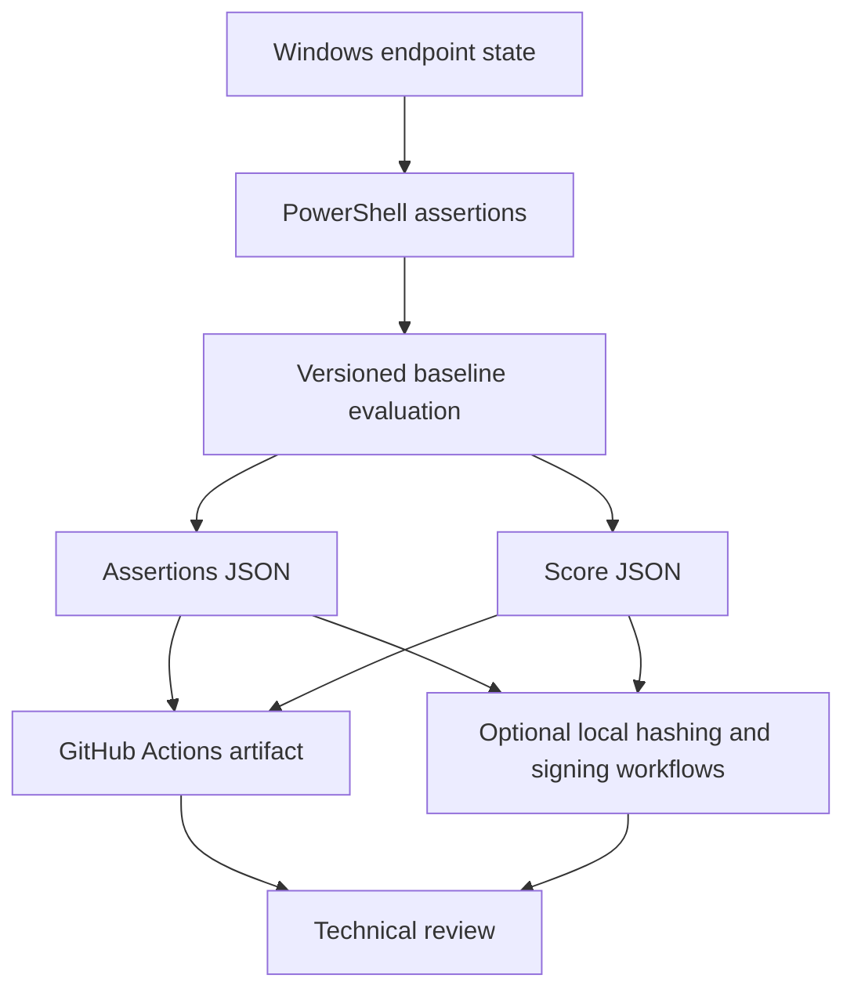
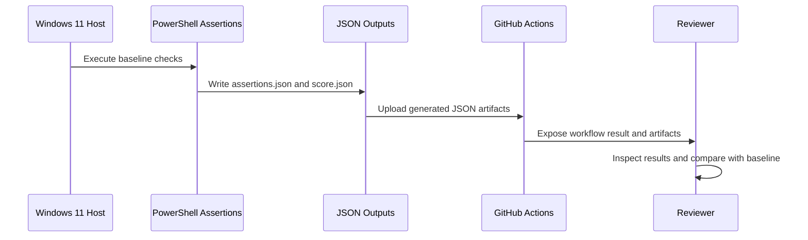
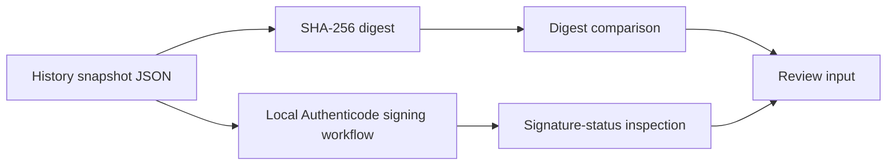

# MAQUEOSYSTEM Security Baseline

A public, non-sensitive security baseline for a Windows 11 Pro endpoint, focused on deterministic control evaluation, versioned evidence, drift detection, and audit-ready documentation.

> This repository documents a point-in-time security posture and the mechanisms used to evaluate it. It does not replace organizational policy, managed security operations, independent attestation, or an external audit.

## Contents

- [Baseline scope](#baseline-scope)
- [Objectives](#objectives)
- [Security architecture](#security-architecture)
- [Control summary](#control-summary)
- [Repository contents](#repository-contents)
- [Verification workflow](#verification-workflow)
- [Quick review guide](#quick-review-guide)
- [Security model highlights](#security-model-highlights)
- [Intended audience](#intended-audience)
- [Limitations](#limitations)
- [Security reporting](#security-reporting)
- [Contributing](#contributing)
- [Roadmap](#roadmap)
- [License](#license)
- [Author](#author)

## Baseline scope

| Field | Value |
|---|---|
| **Version** | `v2026.01` |
| **Platform** | Windows 11 Pro |
| **Scope** | Local endpoint security |
| **Owner** | Andrés Maqueo |
| **Status** | Active reference baseline |
| **Data classification** | Public, non-sensitive |

## Objectives

This repository is designed to demonstrate:

- deterministic security controls;
- reproducible validation;
- versioned evidence generation;
- control traceability;
- drift detection;
- audit readiness;
- attestation preparedness.

## Security architecture

### Architecture domains

- **Boot integrity:** Secure Boot state evaluation.
- **Runtime isolation:** Virtualization-Based Security and Hypervisor-Enforced Code Integrity.
- **Disk protection:** BitLocker protection-state evaluation.
- **Evidence plane:** JSON assertion and score outputs, with optional local hashing or signing workflows.
- **Automation plane:** GitHub Actions executes the CI-safe baseline and uploads generated JSON artifacts.

## Control summary

The authoritative control catalogue is [`baseline/v2026.01.json`](baseline/v2026.01.json).

| Control ID | Control | Implemented assertion | Weight |
|---|---|---|---:|
| `DG-001` | Virtualization-Based Security | `VirtualizationBasedSecurityStatus == 2` | 20 |
| `CI-001` | Hypervisor-Enforced Code Integrity | `CodeIntegrityPolicyEnforcementStatus == 2` | 25 |
| `SB-001` | Secure Boot | `SecureBoot == true` | 20 |
| `BL-001` | BitLocker Enabled | `BitLockerProtection == true` | 15 |

> Only controls present in the versioned baseline are listed as implemented controls. Other platform characteristics may be discussed as architectural context but are not represented as evaluated controls unless they exist in the baseline and assertion scripts.

### Interpretation model

A control result should be interpreted together with:

1. the baseline version;
2. the device and operating-system context;
3. the implemented assertion method;
4. the evidence timestamp;
5. the generated assertion and score outputs;
6. any separately generated hash or signature material;
7. any documented exception or drift.

A passing assertion confirms the observed state at collection time; it does not independently establish continuous compliance.

## Repository contents

### Architecture

- hardware root of trust concepts;
- Secure Boot trust chain;
- VBS and HVCI model;
- trust boundaries;
- attestation readiness;
- endpoint security architecture.

### Audit evidence

- deterministic PowerShell assertions;
- JSON assertion results;
- scored security posture;
- history snapshots;
- optional SHA-256 digest generation;
- optional local signing workflows.

### Governance

- security control traceability matrix;
- risk model;
- audit methodology;
- executive security summary;
- versioned baseline documentation;
- public security-reporting and contribution guidance.

### Automation

- assertion scripts;
- baseline evaluation logic;
- evidence generation;
- GitHub Actions execution;
- artifact upload;
- GitHub Pages publication.

## Verification workflow

### Optional local evidence workflow

The repository contains local scripts that can hash or sign selected history snapshots. These operations are separate from the current GitHub Actions workflow. Signature verification confirms the cryptographic relationship between an artifact and its signer certificate; signer trust requires an independently trusted certificate or chain and is not established merely by using `-noverify`.

## Quick review guide

A reviewer should confirm, at minimum:

1. the baseline version and stated scope;
2. the implemented control IDs in `baseline/v2026.01.json`;
3. the corresponding assertion logic;
4. the generated `assertions.json` and `score.json` outputs;
5. the workflow execution result;
6. the uploaded artifact contents;
7. any separately generated hash or signature material;
8. any documented exceptions or drift.

## Security model highlights

- Secure Boot evaluation;
- VBS evaluation;
- HVCI evaluation;
- BitLocker protection-state evaluation;
- deterministic control evaluation;
- versioned baseline definitions;
- reviewable JSON evidence;
- optional local hashing and signing workflows.

## Intended audience

- security architects;
- auditors;
- DevSecOps engineers;
- Windows platform engineers;
- organizations evaluating endpoint trust models;
- practitioners studying evidence-based security validation.

## Limitations

- This baseline represents a point-in-time snapshot.
- Results depend on the tested Windows edition, build, firmware, hardware, and policy state.
- Local administrative compromise can affect evidence generation unless controls are externally attested.
- A passing assertion does not by itself prove complete organizational compliance.
- The current GitHub Actions workflow uploads assertion and score JSON files but does not validate hashes, CMS artifacts, signer trust, or an evidence schema.
- Cryptographic integrity does not guarantee that the original observation was complete or independently trusted.
- The repository does not contain sensitive production secrets or private organizational policy.

## Security reporting

Do not disclose suspected vulnerabilities, leaked secrets, or sensitive host information in a public issue. Follow the process in [`SECURITY.md`](SECURITY.md).

## Contributing

Documentation corrections, reproducibility improvements, control-mapping proposals, and validation enhancements are welcome. Review [`CONTRIBUTING.md`](CONTRIBUTING.md) before opening a pull request.

## Roadmap

- [ ] Expand the control catalogue and evidence schema.
- [ ] Add machine-readable control mappings.
- [ ] Add CI validation for evidence hashes and schema structure.
- [ ] Add a trust-anchor-based signature verification procedure.
- [ ] Improve drift reporting between baseline versions.
- [ ] Add reproducible evidence verification examples.
- [ ] Add formal release notes and compatibility matrices.
- [ ] Strengthen attestation and provenance documentation.

## License

See [`LICENSE`](LICENSE).

## Author

Maintained by [Andrés Maqueo](https://github.com/AndresMaqueo).
