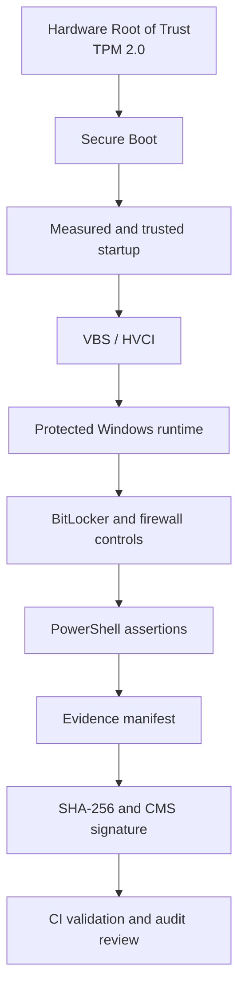
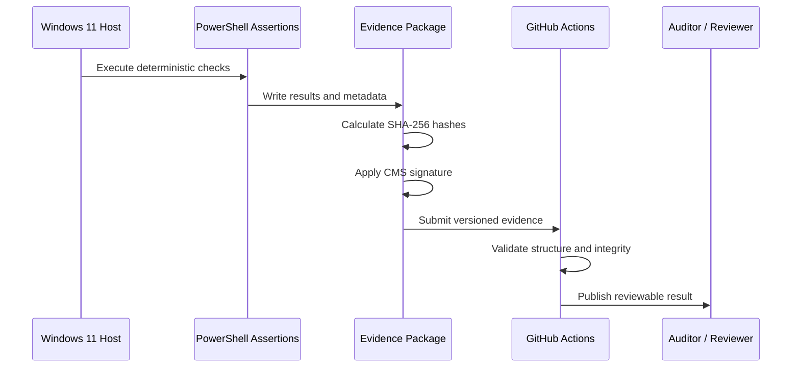
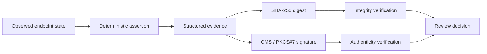

# MAQUEOSYSTEM Security Baseline

A public, non-sensitive security baseline for a Windows 11 Pro endpoint, focused on hardware-backed trust, deterministic controls, cryptographic evidence, drift detection, and audit-ready documentation.

> This repository documents a point-in-time security posture and the mechanisms used to verify it. It does not replace organizational policy, managed security operations, independent attestation, or an external audit.

## Contents

- [Baseline scope](#baseline-scope)
- [Objectives](#objectives)
- [Security architecture](#security-architecture)
- [Control summary](#control-summary)
- [Repository contents](#repository-contents)
- [Verification workflow](#verification-workflow)
- [Quick review guide](#quick-review-guide)
- [Security model highlights](#security-model-highlights)
- [Limitations](#limitations)
- [Security reporting](#security-reporting)
- [Contributing](#contributing)
- [Roadmap](#roadmap)

## Baseline scope

| Field | Value |
|---|---|
| **Version** | `v2026.01` |
| **Platform** | Windows 11 Pro |
| **Scope** | Local endpoint security |
| **Owner** | Andrés Maqueo |
| **Status** | Active reference baseline |
| **Data classification** | Public, non-sensitive |

## Objectives

This repository is designed to demonstrate:

- hardware-backed trust;
- deterministic security controls;
- reproducible validation;
- cryptographically verifiable evidence;
- control traceability;
- drift detection;
- audit readiness;
- attestation preparedness.

## Security architecture

### Architecture domains

- **Hardware root of trust:** TPM 2.0 and platform trust anchors.
- **Boot integrity:** Secure Boot and trusted startup chain.
- **Runtime isolation:** Virtualization-Based Security and Hypervisor-Enforced Code Integrity.
- **Endpoint protection:** BitLocker, Windows Firewall, Defender-related controls, and local hardening.
- **Evidence plane:** deterministic assertions, hashes, signed manifests, and traceability records.
- **Validation plane:** local verification and GitHub Actions-based checks.

## Control summary

| Control ID | Control | Expected state | Evidence type |
|---|---|---|---|
| `SB-001` | Secure Boot | Enabled | PowerShell assertion |
| `TPM-001` | TPM | Present and ready | PowerShell assertion |
| `BL-001` | BitLocker | Enabled | PowerShell assertion |
| `VBS-001` | Virtualization-Based Security | Enabled | PowerShell assertion |
| `HVCI-001` | Memory integrity / HVCI | Enabled | PowerShell assertion |
| `FW-001` | Windows Firewall | Enabled on all profiles | PowerShell assertion |
| `EVID-001` | Evidence integrity | SHA-256 verified | Hash manifest |
| `SIGN-001` | Evidence authenticity | CMS signature present | Signed evidence package |

> This table is an overview. The versioned scripts and evidence files are the authoritative source for the evaluated state.

### Interpretation model

A control result should be interpreted together with:

1. the baseline version;
2. the device and operating-system context;
3. the assertion method;
4. the evidence timestamp;
5. the integrity and signature verification result;
6. any documented exception or drift.

A passing assertion confirms the observed state at collection time; it does not independently establish continuous compliance.

## Repository contents

### Architecture

- hardware root of trust;
- Secure Boot trust chain;
- VBS and HVCI model;
- trust boundaries;
- attestation readiness;
- endpoint security architecture.

### Audit evidence

- deterministic PowerShell assertions;
- evidence manifests;
- SHA-256 hashes;
- CMS / PKCS#7 signatures;
- drift detection;
- scored security posture.

### Governance

- security control traceability matrix;
- risk model;
- audit methodology;
- executive security summary;
- versioned baseline documentation;
- public security-reporting and contribution guidance.

### Automation

- assertion scripts;
- validation logic;
- evidence generation;
- evidence signing;
- CI validation workflows;
- GitHub Pages publication.

## Verification workflow

### Evidence trust chain

## Quick review guide

A reviewer should confirm, at minimum:

1. the baseline version and stated scope;
2. the expected state of each control;
3. the assertion output for every control;
4. the timestamp and collection context;
5. the SHA-256 value of the evidence manifest;
6. the CMS signature verification result;
7. the GitHub Actions validation outcome;
8. any documented exceptions or drift.

## Security model highlights

- TPM-backed disk encryption with BitLocker;
- Secure Boot enforced;
- hypervisor-enforced code integrity;
- Windows Firewall enabled across all profiles;
- deterministic control evaluation;
- cryptographic integrity validation;
- traceable evidence suitable for technical review.

## Intended audience

- security architects;
- auditors;
- DevSecOps engineers;
- Windows platform engineers;
- organizations evaluating endpoint trust models;
- practitioners studying evidence-based security validation.

## Limitations

- This baseline represents a point-in-time snapshot.
- Results depend on the tested Windows edition, build, firmware, hardware, and policy state.
- Local administrative compromise can affect evidence generation unless controls are externally attested.
- A passing assertion does not by itself prove complete organizational compliance.
- Cryptographic integrity does not guarantee that the original observation was complete or independently trusted.
- The repository does not contain sensitive production secrets or private organizational policy.

## Security reporting

Do not disclose suspected vulnerabilities, leaked secrets, or sensitive host information in a public issue. Follow the process in [`SECURITY.md`](SECURITY.md).

## Contributing

Documentation corrections, reproducibility improvements, control-mapping proposals, and validation enhancements are welcome. Review [`CONTRIBUTING.md`](CONTRIBUTING.md) before opening a pull request.

## Roadmap

- [ ] Expand the control catalogue and evidence schema.
- [ ] Add machine-readable control mappings.
- [ ] Improve drift reporting between baseline versions.
- [ ] Add reproducible evidence verification examples.
- [ ] Add formal release notes and compatibility matrices.
- [ ] Strengthen attestation and provenance documentation.

## License

See [`LICENSE`](LICENSE).

## Author

Maintained by [Andrés Maqueo](https://github.com/AndresMaqueo).
